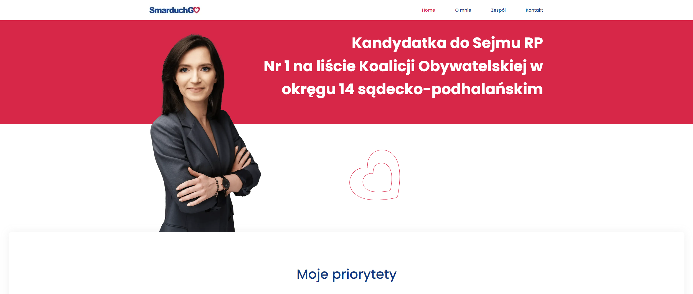
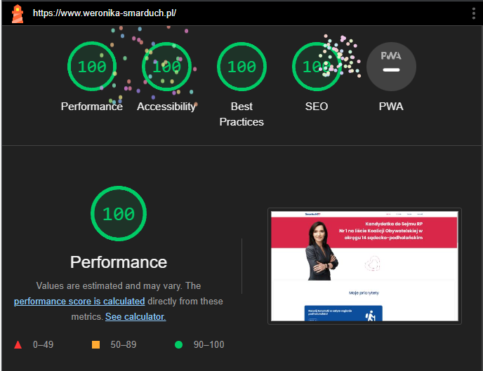

<h1 align='center'>Live💻</h1>

<a target="_blank" href="https://weronika-smarduch.pl" rel="noopener">✨Weronika Smarduch✨</a>

<h2>Performance 💪</h2>

<h2>Built with 🛠</h2> 

Tools | type |
---| --- |
React | JS library |
Next.js | React framework |
Tailwind | Framework CSS |
Framer-motion | Library for animation |

<h2>Details</h2>

A simple website built for my client, who is running for the Republic of Poland parliamentary elections. It took me 3 days to build this site with modern design and animations and then additional time to make minor adjustments

